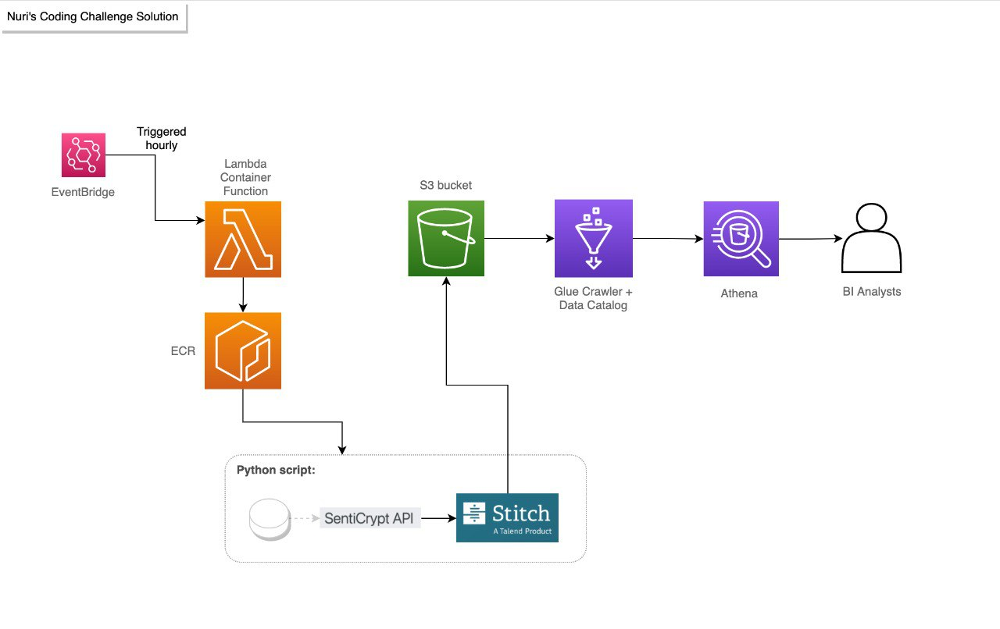

# Nuri Coding Challenge 
<br />

## The challenge

The challenge was to write a Python script to pull market sentiment data from [SentiCrypt API](https://senticrypt.com/) and push it to [Stitch Import API](https://www.stitchdata.com/docs/developers/import-api/). Then write a SQL query to transform this data into a format useful for the BI Analysts. <br /><br />

## The solution

I chose to use AWS Lambda Container Funtion triggered hourly by AWS EventBridge to run a Docker Image stored on AWS ECR. This image contains a Python script that pulls data from SentiCrypt API and pushes it to Stitch Import. Stitch then does the upsert and loads the data to an AWS S3 bucket. Next the data is crawled by AWS Glue Crawler, which will create a Data Catalog that enables it to be queried by AWS Athena. <br /><br />



<br />

## This repository 

| Content                  | Description |
| ------                   | ------ |
| [images]()               | folder with the images used in read.me |
| [docker-compose.yml]()   | docker-compose file |
| [Dockerfile]()           | dockerfile |
| [push.py]()              | script that pulls data from SentiCrypt API and pushes it to Stitch Import API |
| [query_user.sql]()       | transformation query to be used by BI Analysts |
| [query_validation.sql]() | validation queries to check on empty, null and duplicated values |
| [requirements.txt]()     | requirements to run push.py|

<br />

## Replicating the solution 

To run the [Dockerfile](Dockerfile) locally, create a .env file with these environment variables:
OBS: STITCH_REGION should be either 'eu' or 'us'. For more information on how to set the environment, check the [Stitch Documentation](https://www.stitchdata.com/docs/developers/import-api/guides/quick-start).<br />
```
 STITCH_CLIENT_ID = 
 STITCH_TOKEN = 
 STITCH_REGION = 
```

<br />

## Important assumptions and decisions made 

### Python script

Because this data is aggregated by 'timestamp', I chose to create a validation function to check if there are any null or empty timestamps before loading the data. I also decided to check the field 'count'. This field is supposed to return the number of sentiments analyzed in a specific window. So if its value is equal to or lower than 0, the rest of the fields should contain invalid data.

There are only one new field added in this step:
- 'datetime' - added to the Push Message because I was unable to convert 'timestamp' to a date/timestamp type with SQL. This happened due to the type attributed to it by Glue (string). I decided to keep the orinigal field for debug purposes, since it's more precise. 

In the Push Message, I chose to sequence the data using current datetime because.....


### Queries

When loading the data to S3, Stitch adds new fields to the data that cause duplications: '_sdc_batched_at', '_sdc_received_at'. This was handled with the inner join in the queries. The join considers only the maximum '_sdc_batched_at' for each 'timestamp'.

Two validation queries were created in order to make sure there was no duplicated, empty or null 'timestamps'.

Three fields were created in the BI Analysts query:
 - 'date_utc' - date field created from 'datetime' to facilitate date aggregations
 - 'time_utc' - time field (%H:%i:%s) created from 'datetime' to facilitate time aggregations
 - 'median_sentiment' - represents the numeric 'median' field with text values such as 'positive','neutral','negative'. It was created to facilitate categorical analysis. 

Some fields not included in the BI Analysts query:
 - '_sdc_batched_at', '_sdc_received_at', '_sdc_sequence', '_sdc_table_version' - these are added by Stitch to monitor the load, most likely not useful for BI Analysts.
 - 'last' - according to SentiCrypt documentation, "this is not very useful and primarily for debugging", so it's also most likely not useful for BI Analysts.

